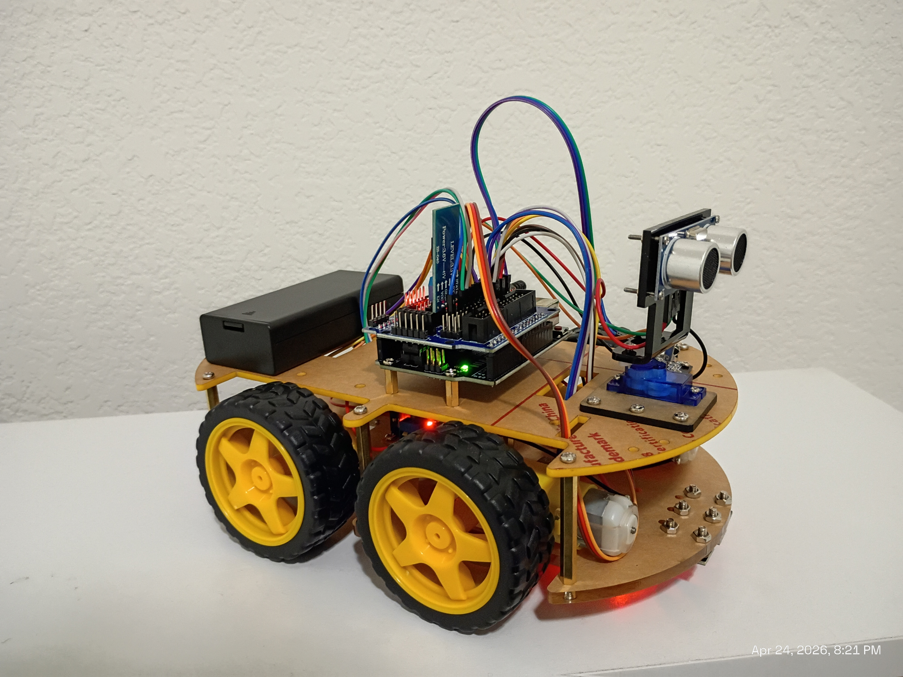

# Robot Car

> A 4-wheel Arduino robot car with Bluetooth control, IR remote, obstacle avoidance, and infrared line tracking — all driven from a custom Android app.

[](https://www.arduino.cc)
[](https://developer.android.com)
[](https://www.java.com)
[](LICENSE)

This project is a fully functional 4-wheel robot car built on an Arduino UNO. It supports three control methods: a custom Android Bluetooth app, an IR remote, and two fully autonomous modes. The car uses an HC-05/HC-06 Bluetooth module to receive commands from the phone, a servo-mounted HC-SR04 ultrasonic sensor for obstacle detection, and three infrared sensors on the underside for line tracking.

 The companion Android app is written in Java and communicates with the car over Classic Bluetooth (SPP). It features a D-pad for manual driving with hold-to-move controls, a one-tap obstacle avoidance toggle, and a one-tap line tracking toggle, all in a clean dark-themed UI.



## Installation

### 1 — Upload the Arduino Sketch

**Requirements:**
- [Arduino IDE](https://www.arduino.cc/en/software) 1.8.x or newer
- Arduino UNO (or compatible board)
- `Servo` library (bundled with Arduino IDE)

**Steps:**

```sh
# Clone the repository
git clone https://github.com/yourname/robot-car.git
cd robot-car
```

1. Open `robot-car-main-code.ino` in the Arduino IDE.
2. Make sure the following files are in the same folder:
   - `IR_remote.cpp` / `IR_remote.h`
   - `Keymap.cpp` / `keymap.h`
3. Select **Tools → Board → Arduino UNO**.
4. Select the correct port under **Tools → Port**.
5. Click **Upload**.

---

### 2 — Build the Android App

**Requirements:**
- [Android Studio](https://developer.android.com/studio) Hedgehog (2023.1.1) or newer
- Android SDK API 21 (Android 5.0) or higher
- A physical Android device (emulators do not support Bluetooth)

**Option A — Android Studio (recommended):**

1. Open Android Studio and choose **Open an Existing Project**.
2. Navigate to `android-app/` and open it.
3. Let Gradle sync finish.
4. Connect your Android phone via USB with **USB Debugging** enabled.
5. Click **Run ▶** (or press `Shift+F10`).

**Option B — Command Line:**

```sh
cd android-app
./gradlew assembleDebug
# APK → app/build/outputs/apk/debug/app-debug.apk
```

```sh
# Install directly to a connected device
./gradlew installDebug
```

---

### 3 — Pair the Bluetooth Module

Before using the app, pair the HC-05 / HC-06 from your phone's system settings:

1. Power on the robot car.
2. Go to **Android Settings → Bluetooth**.
3. Scan and pair with **HC-05** or **HC-06** (default PIN: `1234` or `0000`).
4. The device will now appear in the app's connection list.

## Usage example

**Manual driving:**

Launch the app, tap **Connect to Bluetooth**, and select your module. Once the status bar turns green, use the D-pad to drive. Hold any direction button to keep moving — the car stops the moment you lift your finger.

```
Hold ▲ Forward   → car moves forward at full speed
Hold ▼ Back      → car reverses
Hold ◀ Left      → rotates left
Hold ▶ Right     → rotates right
Tap  ■ Stop      → immediate stop, exits any active mode
```

**Obstacle Avoidance mode:**

Tap the **Obstacle Avoidance** button once. The car drives forward autonomously. When an object is detected within 20 cm, it stops, sweeps the ultrasonic sensor left and right, then turns toward whichever side has more clearance. Tap the button again (or tap Stop) to return to manual control.

**Line Tracking mode:**

Tap **Line Tracking**. The three IR sensors on the underside of the car detect a dark line on a light surface and steer the car to follow it automatically. Tap the button again to stop.

**IR Remote:**

The car also responds to a standard NEC IR remote. The arrow keys map to Forward / Back / Left / Right and the OK button stops the car. IR control and Bluetooth control can be used at the same time — whichever sends a command last takes effect.

## Development setup

**Arduino side:**

All source files live in the root of the repository. No extra library installation is needed beyond the built-in `Servo` library. Open the folder in the Arduino IDE and it will detect the sketch automatically.

```sh
# Verify the sketch compiles without uploading
arduino-cli compile --fqbn arduino:avr:uno robot-car-main-code.ino
```

**Android side:**

The app is a standard Android Gradle project. Open `android-app/` in Android Studio and sync — no extra setup is required.

```sh
# Build a debug APK from the command line
cd android-app
./gradlew assembleDebug

# Run lint checks
./gradlew lint
```

**Pin reference:**

| Pin | Component |
|-----|-----------|
| 2, 4, 5 | Left motor (direction + PWM) |
| 6, 7, 8 | Right motor (direction + PWM) |
| 9, 10, 11 | IR line sensors (Left, Center, Right) |
| 12 | IR receiver |
| A0 | HC-SR04 Echo |
| A1 | HC-SR04 Trigger |
| A2 | Servo (sensor pan) |

## Release History

* 1.0.0
    * Initial release
    * ADD: Bluetooth manual control via Android app
    * ADD: Obstacle avoidance mode (HC-SR04 + servo sweep)
    * ADD: Infrared line tracking mode (3 sensors)
    * ADD: IR remote control (NEC protocol)

## Meta

Sreeharsha K – [@YourTwitter](https://twitter.com/yourtwitter) – your@email.com

Distributed under the MIT license. See `LICENSE` for more information.

[https://github.com/yourname/robot-car](https://github.com/yourname/robot-car)

## Contributing

1. Fork it (<https://github.com/yourname/robot-car/fork>)
2. Create your feature branch (`git checkout -b feature/myFeature`)
3. Commit your changes (`git commit -am 'Add myFeature'`)
4. Push to the branch (`git push origin feature/myFeature`)
5. Create a new Pull Request

## Acknowledgments

* [LAFVIN](https://www.lafvin.com) — for the robot car kit that this project is built on. The LAFVIN 4WD smart car kit provides the chassis, motors, motor driver board, HC-SR04 ultrasonic sensor, IR sensors, and servo mount used in this build. They also provided the foundational code but I edited a lot of it to my custom robot.

<!-- Markdown link & img dfn's -->
[wiki]: https://github.com/yourname/robot-car/wiki
